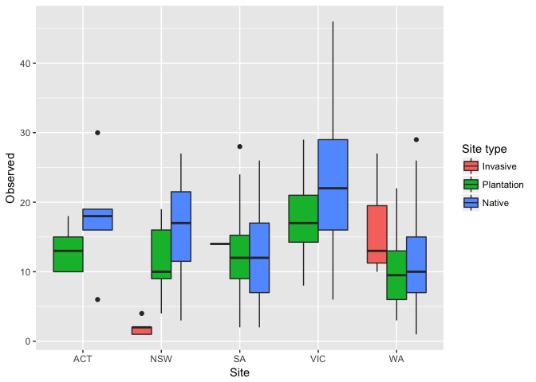
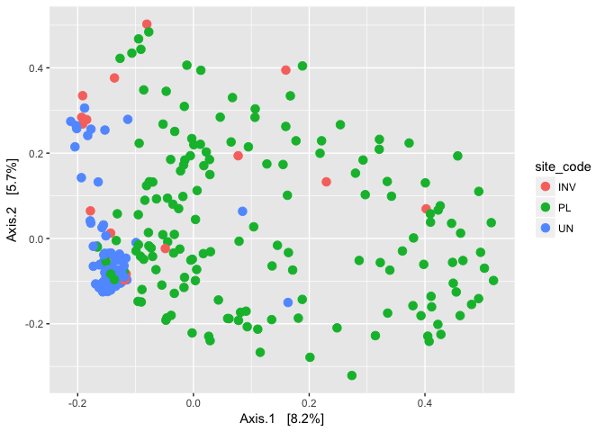

```r
library(phyloseq)
library(dplyr)
library(tidyr)
library(tibble)
library(ggplot2)
library(vegan)
library(readr)
library(ampvis)

load(file = "SOB_files.rda")

#loading Colin's function to assign guild to a taxonomy file
#https://github.com/colinaverill/fg_assign.r
source("fg_assign.r")
```


# Assigning guild to the taxonomy table


```r
str_charc <- function(x) { gsub('[f,p,c,o,k,g,s]__', '', x)}

test <- data.frame(tax_table(SOB_data)) %>% 
  dplyr::rename(kingdom = Kingdom, phylum = Phylum, class = Class, order = Order, family = Family, genus = Genus, species = Species) %>% rownames_to_column( var = "OTU_ID") %>%
  mutate_all(.funs = str_charc) %>%
  column_to_rownames("OTU_ID")


#test.clean <- data.frame(lapply(test, function(x) gsub('[f,p,c,o,k,g,s]__', '', x)))
                    
test.assign <- fg_assign(test)
```

```
## Loading required package: rvest
```

```
## Loading required package: xml2
```

```
## 
## Attaching package: 'rvest'
```

```
## The following object is masked from 'package:readr':
## 
##     guess_encoding
```

```
## Loading required package: jsonlite
```

```
## 68.20201% of taxa assigned a functional guild.
```

#Ectomycorrhiza guild


```r
#Filtering Ecto using Funguild
ecto_OTU <- row.names(test.assign[grepl("Ecto", test.assign$guild),] )

ecto_SOB <- prune_taxa(ecto_OTU, SOB_data.std)
ecto_SOB <- subset_samples(ecto_SOB, site_code != "null")

#alpha diversity
sample_data(ecto_SOB)$obs.physeq <- estimate_richness(ecto_SOB, measures = "Observed") 
head(sample_data((ecto_SOB)))
```

```
##       BarcodeSequence              LinkerPrimerSequence Barcode_right
## RV100        GGAGCTAC TCGTCGGCAGCGTCAGATGTGTATAAGAGACAG      TATCCTCT
## RV101        GGAGCTAC TCGTCGGCAGCGTCAGATGTGTATAAGAGACAG      GTAAGGAG
## RV102        GGAGCTAC TCGTCGGCAGCGTCAGATGTGTATAAGAGACAG      ACTGCATA
## RV103        GGAGCTAC TCGTCGGCAGCGTCAGATGTGTATAAGAGACAG      AAGGAGTA
## RV104        GGAGCTAC TCGTCGGCAGCGTCAGATGTGTATAAGAGACAG      CTAAGCCT
## RV105        GGAGCTAC TCGTCGGCAGCGTCAGATGTGTATAAGAGACAG      CGTCTAAT
##       Index.Number number               code    site_name site_host
## RV100           85    339             WA2 PL Ravensthorpe   radiata
## RV101           97    341             WA2 PL Ravensthorpe   radiata
## RV102          109    342             WA2 PL Ravensthorpe   radiata
## RV103          121    343 Coomalbidgup WA PL Coomalbidgup   radiata
## RV104          133    344             WA2 UN Ravensthorpe       euc
## RV105          145    345             WA2 UN Ravensthorpe       euc
##       site_code                       description location         city
## RV100        PL            roadside Pinus radiata          Coomalbidgup
## RV101        PL            roadside Pinus radiata          Coomalbidgup
## RV102        PL            roadside Pinus radiata          Coomalbidgup
## RV103        PL roadside Pinus radiata wind break          Coomalbidgup
## RV104        UN                     native forest          Ravensthorpe
## RV105        UN                     native forest          Ravensthorpe
##       state                     comment lat long  elev     date
## RV100    WA  WA2 PL sample 34 discarded           77 m 6/23/217
## RV101    WA  WA2 PL sample 34 discarded           77 m 6/23/217
## RV102    WA  WA2 PL sample 34 discarded           77 m 6/23/217
## RV103    WA WA1 UN sample 326 discarded           55 m 6/23/217
## RV104    WA                      WA2 UN          183 m 6/23/217
## RV105    WA                      WA2 UN          183 m 6/23/217
##       Description Observed
## RV100     SOB_339        5
## RV101     SOB_341        4
## RV102     SOB_342        4
## RV103     SOB_343        5
## RV104     SOB_344        2
## RV105     SOB_345        4
```

```r
ggplot(data = sample_data(ecto_SOB), aes(x = state, y =obs.physeq)) +
  geom_boxplot(aes(fill = site_code)) + 
    scale_fill_discrete(labels = c("INV" = "Invasive", 
                              "PL" = "Plantation",
                              "UN" = "Native",
                              "null" = "Nullabor"),
                        name = "Site type") +
  xlab("Site") + ylab("Observed")
```

```
## Don't know how to automatically pick scale for object of type data.frame. Defaulting to continuous.
```

<!-- -->


```r
#dist.ectoSOB <- phyloseq::distance(ecto_SOB, method = "jaccard", binary = TRUE)
ord.ectoSOB <- phyloseq::ordinate(ecto_SOB, "PCoA", "bray", autotransform = TRUE)
plot_ordination(ecto_SOB, ord.ectoSOB, color = "site_code") + geom_point(size = 3)
```

<!-- -->

