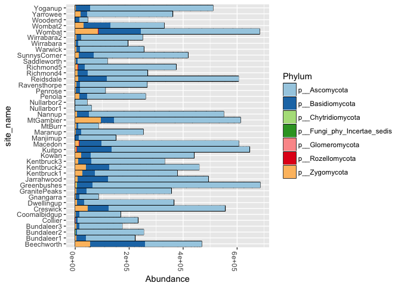
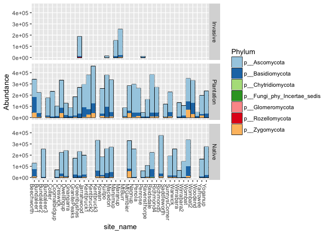
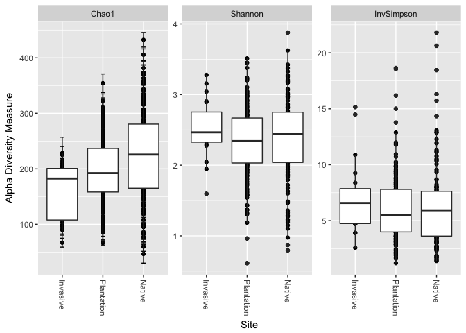
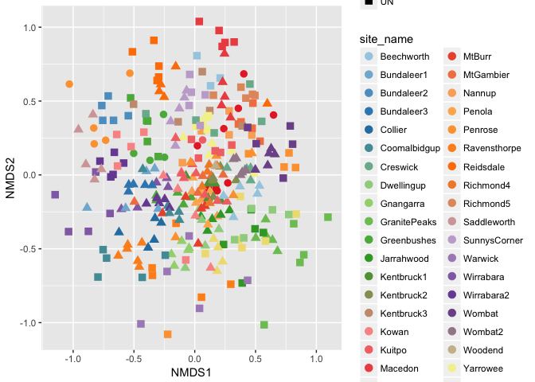
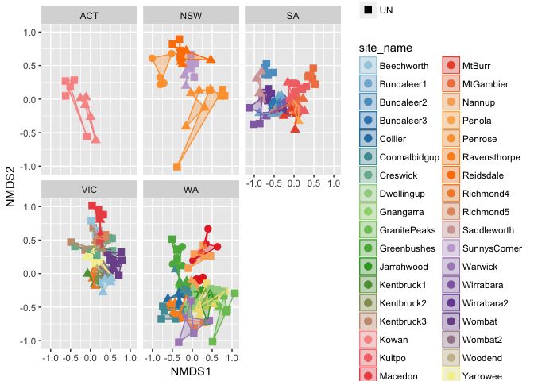
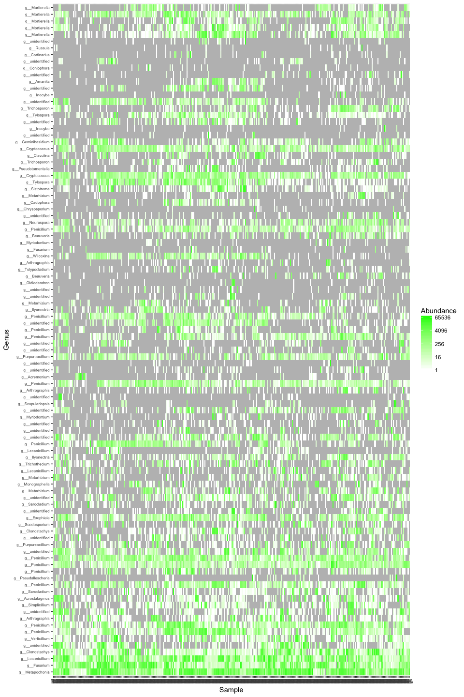
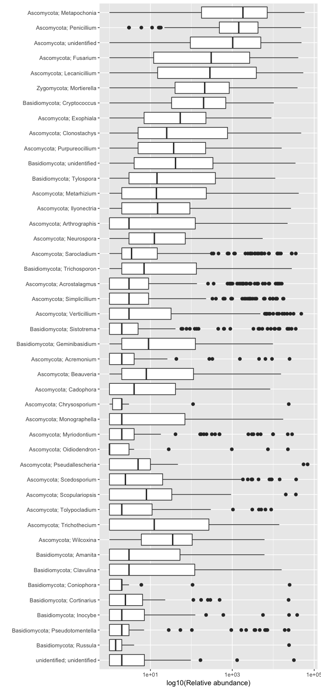
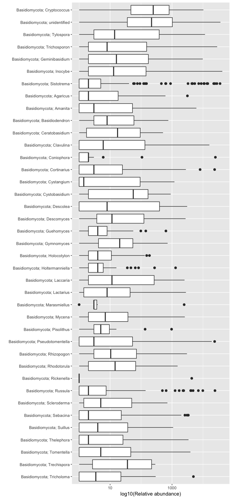
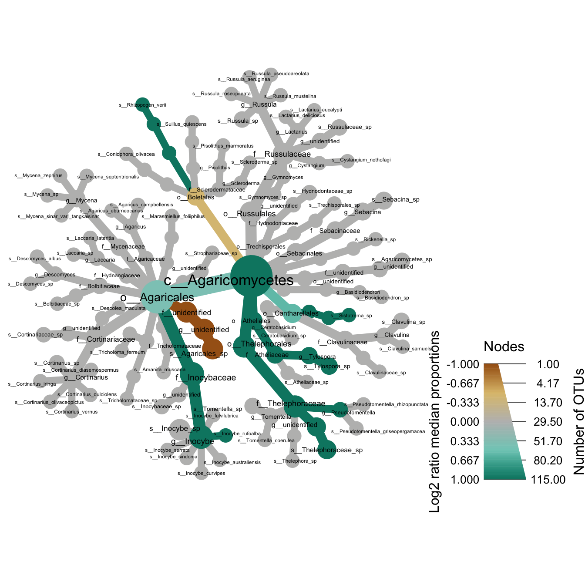

## Import data

Libraries used during this analysis:

```r
library(phyloseq)
library(dplyr)
library(tidyr)
library(tibble)
library(ggplot2)
library(vegan)
library(readr)
```

Creating the otu table:

```r
otu_table_SOB <- read_delim("Complete_data/otu_table.fungi.txt", 
    "\t", escape_double = FALSE, trim_ws = TRUE)
```

```
## Parsed with column specification:
## cols(
##   .default = col_integer(),
##   OTU_ID = col_character(),
##   taxonomy = col_character(),
##   Pident = col_double(),
##   Threshold = col_double()
## )
```

```
## See spec(...) for full column specifications.
```

```r
#Separating objects into OTU table and taxa file
SOB_otu <- otu_table_SOB[,1:319] %>% column_to_rownames(var="OTU_ID") %>% as.matrix()
Pine_taxa <- otu_table_SOB[,c(1,320)] %>%
  separate(col = taxonomy, 
           into = c("taxa",
                    "Phylum",
                    "Class","Order",
                    "Family","Genus",
                    "Species"), sep = ";") %>%
  separate(col = taxa,
           into = c("spp", "genbank", "unite", "reps","Kingdom"), sep = "\\|") %>%
  select(c("OTU_ID","Kingdom", "Phylum",
                    "Class","Order",
                    "Family","Genus",
                    "Species")) %>% 
  column_to_rownames(var = "OTU_ID")
```

Based on the google doc, a metadata file was generated to merge the information with the OTU table and the taxonomy file.  This is the metadata assoicated with samples collected in Australia, we need to work on some of the codes to clean the information.  There are __318 samples__ collected and included in the current study.


```r
SOB_metadata.0 <- read.delim("metadata.txt", sep = "\t") %>% column_to_rownames(var = "SampleID")
SOB_metadata <- sample_data(SOB_metadata.0)
head(SOB_metadata)
```

```
##       BarcodeSequence              LinkerPrimerSequence Barcode_right
## RV100        GGAGCTAC TCGTCGGCAGCGTCAGATGTGTATAAGAGACAG      TATCCTCT
## RV101        GGAGCTAC TCGTCGGCAGCGTCAGATGTGTATAAGAGACAG      GTAAGGAG
## RV102        GGAGCTAC TCGTCGGCAGCGTCAGATGTGTATAAGAGACAG      ACTGCATA
## RV103        GGAGCTAC TCGTCGGCAGCGTCAGATGTGTATAAGAGACAG      AAGGAGTA
## RV104        GGAGCTAC TCGTCGGCAGCGTCAGATGTGTATAAGAGACAG      CTAAGCCT
## RV105        GGAGCTAC TCGTCGGCAGCGTCAGATGTGTATAAGAGACAG      CGTCTAAT
##       Index.Number number               code    site_name site_host
## RV100           85    339             WA2 PL Ravensthorpe   radiata
## RV101           97    341             WA2 PL Ravensthorpe   radiata
## RV102          109    342             WA2 PL Ravensthorpe   radiata
## RV103          121    343 Coomalbidgup WA PL Coomalbidgup   radiata
## RV104          133    344             WA2 UN Ravensthorpe       euc
## RV105          145    345             WA2 UN Ravensthorpe       euc
##       site_code                       description location         city
## RV100        PL            roadside Pinus radiata          Coomalbidgup
## RV101        PL            roadside Pinus radiata          Coomalbidgup
## RV102        PL            roadside Pinus radiata          Coomalbidgup
## RV103        PL roadside Pinus radiata wind break          Coomalbidgup
## RV104        UN                     native forest          Ravensthorpe
## RV105        UN                     native forest          Ravensthorpe
##       state                     comment lat long  elev     date
## RV100    WA  WA2 PL sample 34 discarded           77 m 6/23/217
## RV101    WA  WA2 PL sample 34 discarded           77 m 6/23/217
## RV102    WA  WA2 PL sample 34 discarded           77 m 6/23/217
## RV103    WA WA1 UN sample 326 discarded           55 m 6/23/217
## RV104    WA                      WA2 UN          183 m 6/23/217
## RV105    WA                      WA2 UN          183 m 6/23/217
##       Description
## RV100     SOB_339
## RV101     SOB_341
## RV102     SOB_342
## RV103     SOB_343
## RV104     SOB_344
## RV105     SOB_345
```


Creating the phyloseq object to do the downstream analyses.


```r
#Creating OTU table
SOB_otu <- otu_table(SOB_otu, taxa_are_rows = TRUE)

#Creating taxa object
SOB_taxa <- tax_table(as.matrix(Pine_taxa))

#Creating phyloseq object
SOB_data <- phyloseq(SOB_otu, SOB_taxa, SOB_metadata)
SOB_data
```

```
## phyloseq-class experiment-level object
## otu_table()   OTU Table:         [ 6082 taxa and 318 samples ]
## sample_data() Sample Data:       [ 318 samples by 19 sample variables ]
## tax_table()   Taxonomy Table:    [ 6082 taxa by 7 taxonomic ranks ]
```

```r
#Removing unidentified or other kingdoms
SOB_data <- subset_taxa(SOB_data, Kingdom=="k__Fungi")
```

# Exploratory analyses

First data exploration after generating the phyloseq object in R.  Here is a plot of the abundance of each OTU colored by phyla on each of the locations sampled (there are few categories messed up).

## Bar plots at Phylum level

```r
#Stacked plot
fungi.p <- subset_taxa(SOB_data, Phylum!="p__unidentified")

fungi.p <- tax_glom(fungi.p, taxrank="Phylum")

bar_phyla <- plot_bar(fungi.p, x ="site_name", fill = "Phylum") 
bar_phyla + geom_bar(stat = "identity", position = "stack") + 
  scale_fill_brewer(type = "div", palette = "Paired") + coord_flip() 
```

<!-- -->

Breaking the plot by type of location sampled and the type of forest sampled (INV: Invasive, PL: Plantation, and UN: Native).


```r
fungi.p2 <- subset_samples(fungi.p, site_code != "null")
code_names <- c(INV = "Invasive",
                PL = "Plantation",
                UN = "Native")

bar_phyla_code <- plot_bar(fungi.p2, x = "site_name", fill = "Phylum") 
bar_phyla_code + geom_bar(stat = "identity", position = "stack") + 
  facet_grid(site_code ~ ., labeller = labeller(site_code = code_names)) +
  scale_fill_brewer(type = "div", palette = "Paired")
```

<!-- -->

## Alpha diversity

```r
alpha_SOB <- plot_richness(subset_samples(SOB_data, site_code != "null"),
                           x="site_code", measures = c("Chao1", "Shannon", "InvSimpson"))
alpha_SOB + geom_boxplot() + scale_x_discrete(labels = c("INV" = "Invasive", 
                                                         "PL" = "Plantation",
                                                         "UN" = "Native")) +
  xlab("Site")
```

```
## Warning: Removed 616 rows containing missing values (geom_errorbar).
```

<!-- -->


## Ordination plots


```r
#Palette
library(RColorBrewer)
pal <- colorRampPalette(brewer.pal(12, "Paired"))

#Ordination
SOB_data.1 <- subset_samples(SOB_data, site_code != "null")
ord.SOB <- ordinate(SOB_data.1, "NMDS", "bray")
```

```
## Square root transformation
## Wisconsin double standardization
## Run 0 stress 0.2723927 
## Run 1 stress 0.2717108 
## ... New best solution
## ... Procrustes: rmse 0.00960084  max resid 0.1281292 
## Run 2 stress 0.2720145 
## ... Procrustes: rmse 0.004427395  max resid 0.0746133 
## Run 3 stress 0.2723948 
## Run 4 stress 0.2712646 
## ... New best solution
## ... Procrustes: rmse 0.007144694  max resid 0.08780229 
## Run 5 stress 0.273091 
## Run 6 stress 0.2723756 
## Run 7 stress 0.2711875 
## ... New best solution
## ... Procrustes: rmse 0.002294678  max resid 0.03740667 
## Run 8 stress 0.2717325 
## Run 9 stress 0.271679 
## ... Procrustes: rmse 0.009040815  max resid 0.1480574 
## Run 10 stress 0.2756119 
## Run 11 stress 0.2718454 
## Run 12 stress 0.2737763 
## Run 13 stress 0.2721797 
## Run 14 stress 0.272904 
## Run 15 stress 0.2712316 
## ... Procrustes: rmse 0.005114196  max resid 0.08597093 
## Run 16 stress 0.2731392 
## Run 17 stress 0.2718006 
## Run 18 stress 0.271715 
## Run 19 stress 0.271265 
## ... Procrustes: rmse 0.002385564  max resid 0.03998525 
## Run 20 stress 0.2715312 
## ... Procrustes: rmse 0.008594296  max resid 0.1477338 
## *** No convergence -- monoMDS stopping criteria:
##      1: no. of iterations >= maxit
##     19: stress ratio > sratmax
```

```r
plot_ordination(SOB_data.1, ord.SOB, shape = "site_code", color = "site_name") + 
  geom_point(size = 3) + scale_color_manual(values = pal(42))
```

<!-- -->

```r
#NMDS after removing null samples
ord.SOB.1 <- ordinate(SOB_data.1, "NMDS", "bray")
```

```
## Square root transformation
## Wisconsin double standardization
## Run 0 stress 0.2723927 
## Run 1 stress 0.2732206 
## Run 2 stress 0.2721969 
## ... New best solution
## ... Procrustes: rmse 0.003367634  max resid 0.0486566 
## Run 3 stress 0.2721954 
## ... New best solution
## ... Procrustes: rmse 0.0004205495  max resid 0.003283594 
## ... Similar to previous best
## Run 4 stress 0.2728706 
## Run 5 stress 0.2725496 
## ... Procrustes: rmse 0.00781494  max resid 0.1014878 
## Run 6 stress 0.2746564 
## Run 7 stress 0.2718351 
## ... New best solution
## ... Procrustes: rmse 0.01305554  max resid 0.1481173 
## Run 8 stress 0.2971226 
## Run 9 stress 0.2713396 
## ... New best solution
## ... Procrustes: rmse 0.007732315  max resid 0.09734595 
## Run 10 stress 0.2739079 
## Run 11 stress 0.2723938 
## Run 12 stress 0.2723917 
## Run 13 stress 0.2723947 
## Run 14 stress 0.2723907 
## Run 15 stress 0.2737345 
## Run 16 stress 0.2713173 
## ... New best solution
## ... Procrustes: rmse 0.006536869  max resid 0.08020732 
## Run 17 stress 0.2731003 
## Run 18 stress 0.2718483 
## Run 19 stress 0.2722306 
## Run 20 stress 0.2722122 
## *** No convergence -- monoMDS stopping criteria:
##     20: stress ratio > sratmax
```

```r
plot_ordination(SOB_data.1, ord.SOB.1, shape = "site_code", color = "site_name") + 
  geom_point(size = 3) + geom_polygon(aes(fill=site_name), alpha = 0.3) +
  scale_color_manual(values = pal(42)) +
  scale_fill_manual(values = pal(42)) +
  facet_wrap(~state)
```

<!-- -->

## Heatmap

Focusing on the top 100 OTUs, this is the distribution of OTUs per site.


```r
top100OTU.names <- names(sort(taxa_sums(SOB_data), TRUE)[1:100])

top100OTU <- prune_taxa(top100OTU.names, SOB_data)
heat_100OTU <- plot_heatmap(top100OTU,sample.label = "site_code", sample.order = "site_code", 
                            taxa.label = "Genus", taxa.order = "Phylum",
                            low = "white", high = "green", na.value = "grey")
heat_100OTU +  xlab("site code") + ylab("OTU genera ordered by phyla") +
  theme(axis.text.x = element_text(size = 9), 
        axis.text.y = element_text(size = 6))
```

```
## Warning: Transformation introduced infinite values in discrete y-axis
```

<!-- -->


## Rank abundance
This is a rank abundance plot of the top 100 OTUs:


```r
library(ampvis)
amp_rabund(top100OTU, tax.aggregate = "Genus", tax.add = "Phylum", tax.show = 200,
           plot.log = TRUE) + ylab("log10(Relative abundance)")
```

<!-- -->

If we limit this rank abundance to members of the phylum Basidiomycota, this is the distribution of the __top 150 Basidio OTUs__:


```r
library(ampvis)
fungi.basidio <- subset_taxa(SOB_data, Phylum=="p__Basidiomycota")
top150OTU.names <- names(sort(taxa_sums(fungi.basidio), TRUE)[1:150])
top150OTU <- prune_taxa(top150OTU.names, fungi.basidio)

p1.ht <- ampvis::amp_rabund(top150OTU, tax.aggregate = "Genus", tax.add = "Phylum", 
          plot.log = TRUE) 
p1.ht + ylab("log10(Relative abundance)")
```

<!-- -->


## Metacoder analysis

Using top 500 OTUs and focusing only in the agaricomycetes, this is the distribution of the different taxonomic levels below the __class Agaricomycetes__.


```r
library(metacoder)

top500OTU.names <- names(sort(taxa_sums(SOB_data), TRUE)[1:500])

top500OTU <- prune_taxa(top500OTU.names, SOB_data)

#Converting to metacoder
obj <- parse_phyloseq(top500OTU)

# Convert counts to proportions
obj$data$otu_table <- calc_obs_props(obj,
                                     dataset = "otu_table",
                                     cols = obj$data$sam_data$sample_ids)
# Calculate per-taxon proportions
obj$data$tax_table <- calc_taxon_abund(obj,
                                       dataset = "otu_table",
                                       cols = obj$data$sam_data$sample_ids)

#Compare treatments
obj$data$diff_table <- compare_groups(obj,
                                          dataset = "tax_table",
                                          cols = obj$data$sam_data$sample_ids,
                                          groups = obj$data$sam_data$site_code)
```


```r
#Tree visual
set.seed(1)
Tree1 <- metacoder::heat_tree(taxa::filter_taxa(obj, taxon_names == "c__Agaricomycetes", subtaxa = TRUE),
          node_size = n_obs, 
          node_label = taxon_names,
          node_color = log2_median_ratio,
          node_color_range = c("#a6611a","#dfc27d","#bdbdbd","#80cdc1","#018571"), 
          node_color_trans = "linear",
          node_label_max = 120,
          node_color_interval = c(-1, 1),
          edge_color_interval = c(-1, 1),
          node_size_axis_label = "Number of OTUs",
          node_color_axis_label = "Log2 ratio median proportions",
          initial_layout = "reingold-tilford", layout = "davidson-harel")

Tree1
```

<!-- -->


