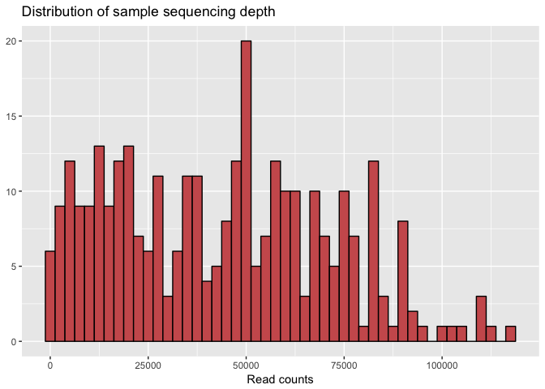
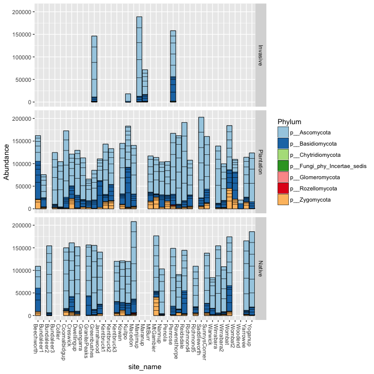
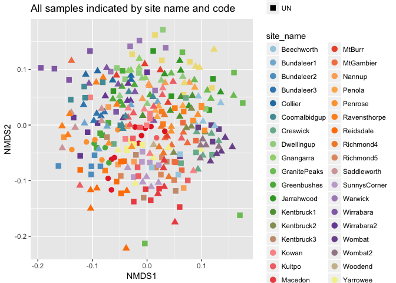
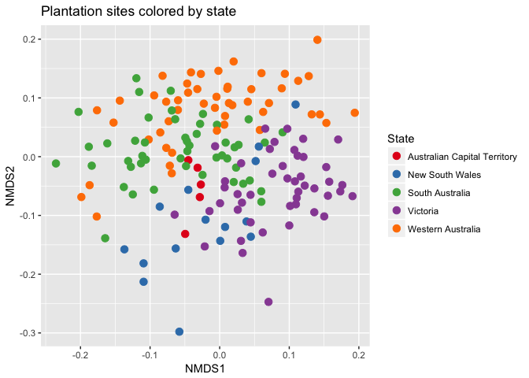
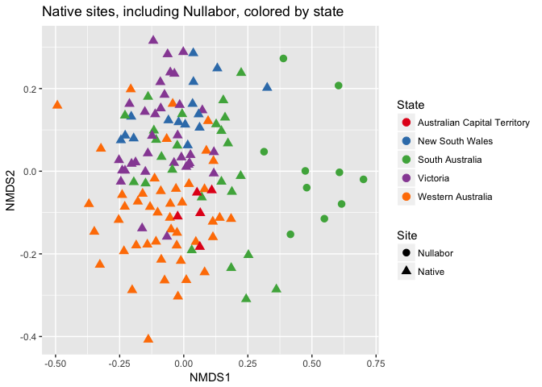
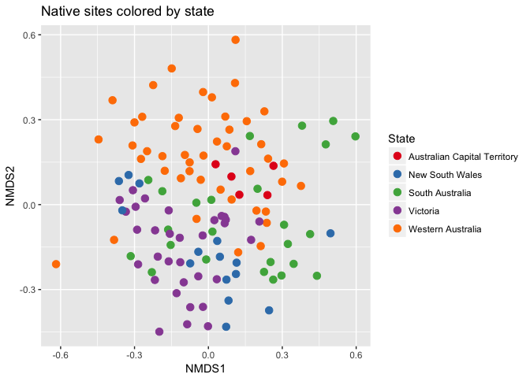
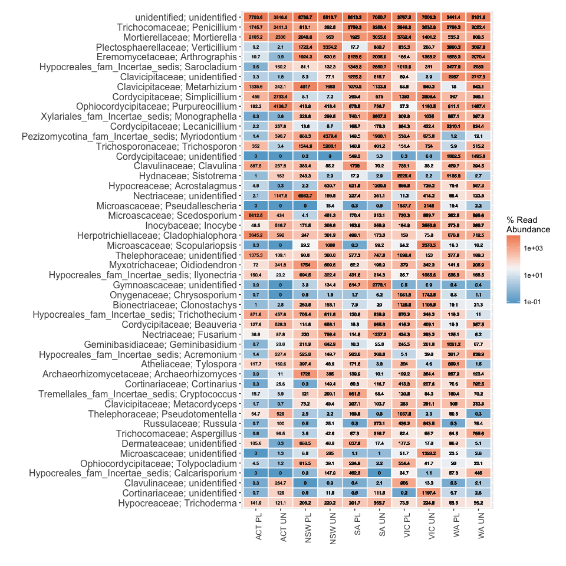
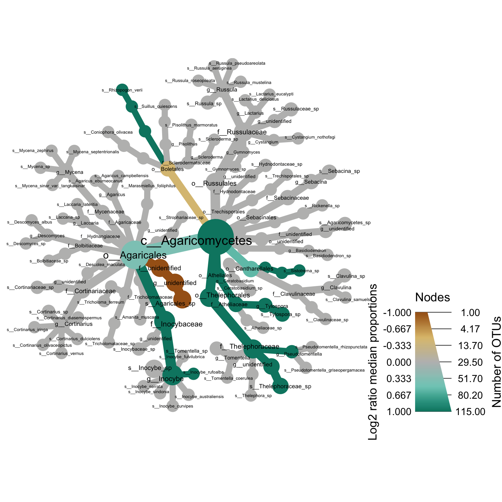
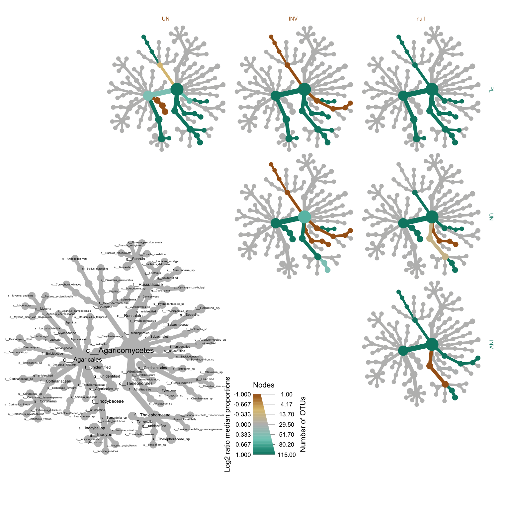

```r
library(phyloseq)
library(dplyr)
library(tidyr)
library(tibble)
library(ggplot2)
library(vegan)
library(readr)
library(ampvis)

load(file = "SOB_files.rda")
```

## Checking sequencing depth


```r
# Make a data frame with a column for the read counts of each sample
sample_sum_df <- data.frame(sum = sample_sums(SOB_data))

# Histogram of sample read counts
ggplot(sample_sum_df, aes(x = sum)) + 
  geom_histogram(color = "black", fill = "indianred", binwidth = 2500) +
  ggtitle("Distribution of sample sequencing depth") + 
  xlab("Read counts") +
  theme(axis.title.y = element_blank())
```

<!-- -->

## Standardizing by sequencing depth


```r
#Standardize abundances to the median sequencing depth
total <- median(sample_sums(SOB_data))
standf <- function(x, t=total) round(t * (x/sum(x)))
SOB_data.std <- transform_sample_counts(SOB_data, standf)

#Filter taxa with cutoff 3.0 Coefficient of Variation
SOB_data.stdf <- filter_taxa(SOB_data.std, function(x) sd(x)/mean(x) > 3.0, TRUE)
```

## Bar plots after standardizing


```r
fungi.p <- subset_taxa(SOB_data.stdf, Phylum!="p__unidentified")
fungi.p <- tax_glom(fungi.p, taxrank="Phylum")
fungi.p2 <- subset_samples(fungi.p, site_code != "null")

code_names <- c(INV = "Invasive",
                PL = "Plantation",
                UN = "Native")

bar_phyla_code <- plot_bar(fungi.p2, x = "site_name", fill = "Phylum") 
bar_phyla_code + geom_bar(stat = "identity", color="black", size=0.2,position = "stack") + 
  facet_grid(site_code ~ ., labeller = labeller(site_code = code_names)) +
  scale_fill_brewer(type = "div", palette = "Paired")
```

<!-- -->

## Ordination

### Original plot


```r
#Transforming to proportions
SOB_data.prop <- transform_sample_counts(SOB_data.stdf, function(otu) otu/sum(otu))
SOB_data.prop1 <- subset_samples(SOB_data.prop, site_code != "null")

#Palette
library(RColorBrewer)
pal <- colorRampPalette(brewer.pal(12, "Paired"))

#Ordination
ord.SOB <- ordinate(SOB_data.prop1, "NMDS", "bray")
```

```
## Run 0 stress 0.3272439 
## Run 1 stress 0.3243899 
## ... New best solution
## ... Procrustes: rmse 0.02818077  max resid 0.2211649 
## Run 2 stress 0.3283675 
## Run 3 stress 0.3244585 
## ... Procrustes: rmse 0.01588462  max resid 0.1252745 
## Run 4 stress 0.3279208 
## Run 5 stress 0.3302931 
## Run 6 stress 0.3258185 
## Run 7 stress 0.3472096 
## Run 8 stress 0.3240984 
## ... New best solution
## ... Procrustes: rmse 0.02164164  max resid 0.2233537 
## Run 9 stress 0.3266316 
## Run 10 stress 0.3248296 
## Run 11 stress 0.3243145 
## ... Procrustes: rmse 0.009625093  max resid 0.1237799 
## Run 12 stress 0.3233306 
## ... New best solution
## ... Procrustes: rmse 0.02617904  max resid 0.2190102 
## Run 13 stress 0.3239668 
## Run 14 stress 0.324416 
## Run 15 stress 0.3246235 
## Run 16 stress 0.3245284 
## Run 17 stress 0.3245985 
## Run 18 stress 0.3267509 
## Run 19 stress 0.3261359 
## Run 20 stress 0.3242178 
## *** No convergence -- monoMDS stopping criteria:
##     20: stress ratio > sratmax
```

```r
plot_ordination(SOB_data.prop1, ord.SOB, shape = "site_code", color = "site_name") + 
  geom_point(size = 3) + scale_color_manual(values = pal(42)) + labs(title = "All samples indicated by site name and code")
```

<!-- -->


### Focusing on Plantations


```r
#Filtering data
SOB_data.prop.PL <- subset_samples(SOB_data.prop, site_code == "PL")

#Ordination
ord.SOB.PL <- ordinate(SOB_data.prop.PL, "NMDS", "bray")
```

```
## Run 0 stress 0.2891296 
## Run 1 stress 0.2877106 
## ... New best solution
## ... Procrustes: rmse 0.01697993  max resid 0.1594488 
## Run 2 stress 0.2967632 
## Run 3 stress 0.3244926 
## Run 4 stress 0.2887113 
## Run 5 stress 0.2916892 
## Run 6 stress 0.2890967 
## Run 7 stress 0.289126 
## Run 8 stress 0.3193251 
## Run 9 stress 0.293239 
## Run 10 stress 0.2932197 
## Run 11 stress 0.2895772 
## Run 12 stress 0.2989272 
## Run 13 stress 0.293535 
## Run 14 stress 0.2923788 
## Run 15 stress 0.287772 
## ... Procrustes: rmse 0.009977325  max resid 0.106816 
## Run 16 stress 0.291933 
## Run 17 stress 0.2878691 
## ... Procrustes: rmse 0.004589143  max resid 0.05029912 
## Run 18 stress 0.2904463 
## Run 19 stress 0.2907025 
## Run 20 stress 0.289575 
## *** No convergence -- monoMDS stopping criteria:
##      2: no. of iterations >= maxit
##     18: stress ratio > sratmax
```

```r
plot_ordination(SOB_data.prop.PL, ord.SOB.PL, color = "state") + 
  geom_point(size = 3) + scale_color_brewer(type = "div", palette = "Set1",
                                            name = "State",
                                            labels = c("Australian Capital Territory",
                                                       "New South Wales",
                                                       "South Australia",
                                                       "Victoria",
                                                       "Western Australia")) +
  labs(title = "Plantation sites colored by state")
```

<!-- -->

### Focusing on Native sites including Nullabor


```r
#Filtering data
SOB_data.prop.UN <- subset_samples(SOB_data.prop, 
                                   site_code == "UN" |
                                    site_code == "null")

#Ordination
ord.SOB.UN <- ordinate(SOB_data.prop.UN, "NMDS", "bray")
```

```
## Run 0 stress 0.295749 
## Run 1 stress 0.2910937 
## ... New best solution
## ... Procrustes: rmse 0.04949919  max resid 0.2330599 
## Run 2 stress 0.3021597 
## Run 3 stress 0.3020633 
## Run 4 stress 0.2907165 
## ... New best solution
## ... Procrustes: rmse 0.03531404  max resid 0.2439377 
## Run 5 stress 0.292584 
## Run 6 stress 0.2883373 
## ... New best solution
## ... Procrustes: rmse 0.04254253  max resid 0.2363229 
## Run 7 stress 0.2903472 
## Run 8 stress 0.2904571 
## Run 9 stress 0.3054103 
## Run 10 stress 0.2893309 
## Run 11 stress 0.2928074 
## Run 12 stress 0.2979571 
## Run 13 stress 0.293485 
## Run 14 stress 0.2904033 
## Run 15 stress 0.2908162 
## Run 16 stress 0.3006643 
## Run 17 stress 0.2901097 
## Run 18 stress 0.2967128 
## Run 19 stress 0.298456 
## Run 20 stress 0.2887121 
## ... Procrustes: rmse 0.01090583  max resid 0.1051178 
## *** No convergence -- monoMDS stopping criteria:
##      3: no. of iterations >= maxit
##     17: stress ratio > sratmax
```

```r
plot_ordination(SOB_data.prop.UN, ord.SOB.UN, color = "state", shape = "site_code") + 
  geom_point(size = 3) + scale_color_brewer(type = "div", palette = "Set1",
                                            name = "State",
                                            labels = c("Australian Capital Territory",
                                                       "New South Wales",
                                                       "South Australia",
                                                       "Victoria",
                                                       "Western Australia")) +
  scale_shape_discrete(labels = c("Nullabor", "Native"), name = "Site") +
  labs(title = "Native sites, including Nullabor, colored by state")
```

<!-- -->


### Focusing on __only Native sites__


```r
#Filtering data
SOB_data.prop.UN1 <- subset_samples(SOB_data.prop, site_code == "UN")

#Ordination
ord.SOB.UN1 <- ordinate(SOB_data.prop.UN1, "NMDS", "bray")
```

```
## Run 0 stress 0.3250856 
## Run 1 stress 0.3148827 
## ... New best solution
## ... Procrustes: rmse 0.0686631  max resid 0.2637158 
## Run 2 stress 0.3172749 
## Run 3 stress 0.3254674 
## Run 4 stress 0.3142418 
## ... New best solution
## ... Procrustes: rmse 0.03180832  max resid 0.306996 
## Run 5 stress 0.3211447 
## Run 6 stress 0.3150423 
## Run 7 stress 0.3146323 
## ... Procrustes: rmse 0.02273558  max resid 0.1436855 
## Run 8 stress 0.3142044 
## ... New best solution
## ... Procrustes: rmse 0.005213734  max resid 0.03138783 
## Run 9 stress 0.317204 
## Run 10 stress 0.3152266 
## Run 11 stress 0.3151926 
## Run 12 stress 0.3297733 
## Run 13 stress 0.3277722 
## Run 14 stress 0.3155472 
## Run 15 stress 0.3239271 
## Run 16 stress 0.3268489 
## Run 17 stress 0.3221089 
## Run 18 stress 0.3203907 
## Run 19 stress 0.31722 
## Run 20 stress 0.3142319 
## ... Procrustes: rmse 0.004519107  max resid 0.03055722 
## *** No convergence -- monoMDS stopping criteria:
##      4: no. of iterations >= maxit
##     16: stress ratio > sratmax
```

```r
plot_ordination(SOB_data.prop.UN1, ord.SOB.UN1, color = "state") +
  geom_point(size = 3) + 
  scale_color_brewer(type = "div", palette = "Set1", name = "State",
                     labels = c("Australian Capital Territory",
                                "New South Wales",
                                "South Australia",
                                "Victoria",
                                "Western Australia")) + 
  scale_shape_discrete(labels = c("Nullabor", "Native"), name = "Site") +
  labs(title = "Native sites colored by state")
```

<!-- -->

## Heatmap

### Heatmap of plantation and native sites


```r
#Filtering data only to plantation and native sites
SOB_data.stdf.1 <- subset_samples(SOB_data.stdf, 
                                   site_code == "UN" |
                                    site_code == "PL")

#Heatmap
amp_heatmap(data = SOB_data.stdf.1,
            group = c("state", "site_code"),
            tax.show = 50,
            scale.seq = 100,
            plot.text.size = 2,
            tax.aggregate = "Genus",
            tax.add = "Family")
```

```
## Warning: Transformation introduced infinite values in discrete y-axis
```

<!-- -->


## Metacoder comparison

### Original Tree


```r
Tree1
```

<!-- -->


### Plantation vs Native


```r
#Tree visual
set.seed(1)
metacoder::heat_tree_matrix(taxa::filter_taxa(obj, taxon_names == "c__Agaricomycetes", subtaxa = TRUE),
                            dataset = "diff_table",
                            node_size = n_obs, 
                            node_label = taxon_names,
                            node_color = log2_median_ratio,
                            node_color_range = c("#a6611a","#dfc27d","#bdbdbd","#80cdc1","#018571"), 
                            node_color_trans = "linear",
                            node_label_max = 120,
                            node_color_interval = c(-1, 1),
                            edge_color_interval = c(-1, 1),
                            node_size_axis_label = "Number of OTUs",
                            node_color_axis_label = "Log2 ratio median proportions",
                            initial_layout = "reingold-tilford", layout = "davidson-harel")
```

<!-- -->
