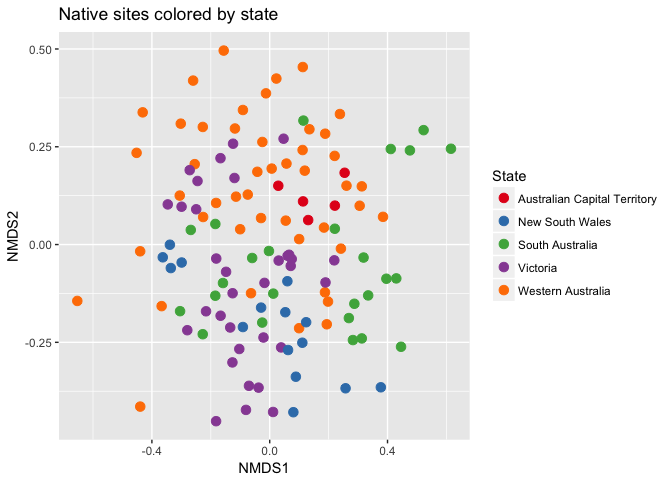

```r
library(phyloseq)
library(dplyr)
library(tidyr)
library(tibble)
library(ggplot2)
library(vegan)
library(readr)
library(ampvis)

load(file = "SOB_files.rda")
```

## Checking sequencing depth


```r
# Make a data frame with a column for the read counts of each sample
sample_sum_df <- data.frame(sum = sample_sums(SOB_data))

# Histogram of sample read counts
ggplot(sample_sum_df, aes(x = sum)) + 
  geom_histogram(color = "black", fill = "indianred", binwidth = 2500) +
  ggtitle("Distribution of sample sequencing depth") + 
  xlab("Read counts") +
  theme(axis.title.y = element_blank())
```

<!-- -->

## Standardizing by sequencing depth


```r
#Standardize abundances to the median sequencing depth
total <- median(sample_sums(SOB_data))
standf <- function(x, t=total) round(t * (x/sum(x)))
SOB_data.std <- transform_sample_counts(SOB_data, standf)

#Filter taxa with cutoff 3.0 Coefficient of Variation
SOB_data.stdf <- filter_taxa(SOB_data.std, function(x) sd(x)/mean(x) > 3.0, TRUE)
```

## Bar plots after standardizing


```r
fungi.p <- subset_taxa(SOB_data.stdf, Phylum!="p__unidentified")
fungi.p <- tax_glom(fungi.p, taxrank="Phylum")
fungi.p2 <- subset_samples(fungi.p, site_code != "null")

code_names <- c(INV = "Invasive",
                PL = "Plantation",
                UN = "Native")

bar_phyla_code <- plot_bar(fungi.p2, x = "site_name", fill = "Phylum") 
bar_phyla_code + geom_bar(stat = "identity", color="black", size=0.2,position = "stack") + 
  facet_grid(site_code ~ ., labeller = labeller(site_code = code_names)) +
  scale_fill_brewer(type = "div", palette = "Paired")
```

<!-- -->

## Ordination

### Original plot


```r
#Transforming to proportions
SOB_data.prop <- transform_sample_counts(SOB_data.stdf, function(otu) otu/sum(otu))
SOB_data.prop1 <- subset_samples(SOB_data.prop, site_code != "null")

#Palette
library(RColorBrewer)
pal <- colorRampPalette(brewer.pal(12, "Paired"))

#Ordination
ord.SOB <- ordinate(SOB_data.prop1, "NMDS", "bray")
```

```
## Run 0 stress 0.3272439 
## Run 1 stress 0.3358327 
## Run 2 stress 0.333735 
## Run 3 stress 0.3252148 
## ... New best solution
## ... Procrustes: rmse 0.0197577  max resid 0.2294536 
## Run 4 stress 0.3251114 
## ... New best solution
## ... Procrustes: rmse 0.02524615  max resid 0.2186668 
## Run 5 stress 0.327906 
## Run 6 stress 0.3246175 
## ... New best solution
## ... Procrustes: rmse 0.01966239  max resid 0.1586432 
## Run 7 stress 0.4182376 
## Run 8 stress 0.325142 
## Run 9 stress 0.3259399 
## Run 10 stress 0.3229439 
## ... New best solution
## ... Procrustes: rmse 0.02228391  max resid 0.2227812 
## Run 11 stress 0.3231946 
## ... Procrustes: rmse 0.007421908  max resid 0.1053651 
## Run 12 stress 0.3233585 
## ... Procrustes: rmse 0.01428077  max resid 0.2275235 
## Run 13 stress 0.3301648 
## Run 14 stress 0.323716 
## Run 15 stress 0.3262954 
## Run 16 stress 0.3242287 
## Run 17 stress 0.324826 
## Run 18 stress 0.3245281 
## Run 19 stress 0.3255049 
## Run 20 stress 0.3239731 
## *** No convergence -- monoMDS stopping criteria:
##      3: no. of iterations >= maxit
##     17: stress ratio > sratmax
```

```r
plot_ordination(SOB_data.prop1, ord.SOB, shape = "site_code", color = "site_name") + 
  geom_point(size = 3) + scale_color_manual(values = pal(42)) + labs(title = "All samples indicated by site name and code")
```

<!-- -->


### Focusing on Plantations


```r
#Filtering data
SOB_data.prop.PL <- subset_samples(SOB_data.prop, site_code == "PL")

#Ordination
ord.SOB.PL <- ordinate(SOB_data.prop.PL, "NMDS", "bray")
```

```
## Run 0 stress 0.2891296 
## Run 1 stress 0.2939355 
## Run 2 stress 0.2886745 
## ... New best solution
## ... Procrustes: rmse 0.02097771  max resid 0.1585497 
## Run 3 stress 0.289357 
## Run 4 stress 0.2892885 
## Run 5 stress 0.2893581 
## Run 6 stress 0.2908114 
## Run 7 stress 0.2889711 
## ... Procrustes: rmse 0.01903144  max resid 0.1756168 
## Run 8 stress 0.291271 
## Run 9 stress 0.2905243 
## Run 10 stress 0.2923748 
## Run 11 stress 0.2893052 
## Run 12 stress 0.2924048 
## Run 13 stress 0.290536 
## Run 14 stress 0.28889 
## ... Procrustes: rmse 0.004728383  max resid 0.0489993 
## Run 15 stress 0.2893555 
## Run 16 stress 0.2896061 
## Run 17 stress 0.2908989 
## Run 18 stress 0.2878915 
## ... New best solution
## ... Procrustes: rmse 0.01305592  max resid 0.119393 
## Run 19 stress 0.2910043 
## Run 20 stress 0.2877801 
## ... New best solution
## ... Procrustes: rmse 0.01008002  max resid 0.1079592 
## *** No convergence -- monoMDS stopping criteria:
##      3: no. of iterations >= maxit
##     17: stress ratio > sratmax
```

```r
plot_ordination(SOB_data.prop.PL, ord.SOB.PL, color = "state") + 
  geom_point(size = 3) + scale_color_brewer(type = "div", palette = "Set1",
                                            name = "State",
                                            labels = c("Australian Capital Territory",
                                                       "New South Wales",
                                                       "South Australia",
                                                       "Victoria",
                                                       "Western Australia")) +
  labs(title = "Plantation sites colored by state")
```

<!-- -->

### Focusing on Native sites including Nullabor


```r
#Filtering data
SOB_data.prop.UN <- subset_samples(SOB_data.prop, 
                                   site_code == "UN" |
                                    site_code == "null")

#Ordination
ord.SOB.UN <- ordinate(SOB_data.prop.UN, "NMDS", "bray")
```

```
## Run 0 stress 0.295749 
## Run 1 stress 0.3032717 
## Run 2 stress 0.2927674 
## ... New best solution
## ... Procrustes: rmse 0.05524421  max resid 0.229019 
## Run 3 stress 0.2887389 
## ... New best solution
## ... Procrustes: rmse 0.0456279  max resid 0.2371747 
## Run 4 stress 0.2904268 
## Run 5 stress 0.2956856 
## Run 6 stress 0.2996751 
## Run 7 stress 0.2885097 
## ... New best solution
## ... Procrustes: rmse 0.02267487  max resid 0.2460066 
## Run 8 stress 0.2917857 
## Run 9 stress 0.2916008 
## Run 10 stress 0.2966288 
## Run 11 stress 0.2947973 
## Run 12 stress 0.2931249 
## Run 13 stress 0.2893764 
## Run 14 stress 0.2940425 
## Run 15 stress 0.2988873 
## Run 16 stress 0.2902169 
## Run 17 stress 0.2926751 
## Run 18 stress 0.3011673 
## Run 19 stress 0.2885058 
## ... New best solution
## ... Procrustes: rmse 0.02728989  max resid 0.2492674 
## Run 20 stress 0.3004677 
## *** No convergence -- monoMDS stopping criteria:
##      2: no. of iterations >= maxit
##     18: stress ratio > sratmax
```

```r
plot_ordination(SOB_data.prop.UN, ord.SOB.UN, color = "state", shape = "site_code") + 
  geom_point(size = 3) + scale_color_brewer(type = "div", palette = "Set1",
                                            name = "State",
                                            labels = c("Australian Capital Territory",
                                                       "New South Wales",
                                                       "South Australia",
                                                       "Victoria",
                                                       "Western Australia")) +
  scale_shape_discrete(labels = c("Nullabor", "Native"), name = "Site") +
  labs(title = "Native sites, including Nullabor, colored by state")
```

<!-- -->


### Focusing on __only Native sites__


```r
#Filtering data
SOB_data.prop.UN1 <- subset_samples(SOB_data.prop, site_code == "UN")

#Ordination
ord.SOB.UN1 <- ordinate(SOB_data.prop.UN1, "NMDS", "bray")
```

```
## Run 0 stress 0.3250856 
## Run 1 stress 0.3248333 
## ... New best solution
## ... Procrustes: rmse 0.03782476  max resid 0.2085237 
## Run 2 stress 0.3146883 
## ... New best solution
## ... Procrustes: rmse 0.06303572  max resid 0.2198325 
## Run 3 stress 0.3166515 
## Run 4 stress 0.3253467 
## Run 5 stress 0.3143736 
## ... New best solution
## ... Procrustes: rmse 0.009989011  max resid 0.08670513 
## Run 6 stress 0.3268375 
## Run 7 stress 0.3180081 
## Run 8 stress 0.3154716 
## Run 9 stress 0.3284646 
## Run 10 stress 0.3146426 
## ... Procrustes: rmse 0.0274896  max resid 0.1444298 
## Run 11 stress 0.3310118 
## Run 12 stress 0.3156499 
## Run 13 stress 0.3146445 
## ... Procrustes: rmse 0.009835445  max resid 0.08641049 
## Run 14 stress 0.3146157 
## ... Procrustes: rmse 0.01239383  max resid 0.08405933 
## Run 15 stress 0.321096 
## Run 16 stress 0.3156904 
## Run 17 stress 0.3318211 
## Run 18 stress 0.3153562 
## Run 19 stress 0.3247976 
## Run 20 stress 0.3196146 
## *** No convergence -- monoMDS stopping criteria:
##      2: no. of iterations >= maxit
##     18: stress ratio > sratmax
```

```r
plot_ordination(SOB_data.prop.UN1, ord.SOB.UN1, color = "state") +
  geom_point(size = 3) + 
  scale_color_brewer(type = "div", palette = "Set1", name = "State",
                     labels = c("Australian Capital Territory",
                                "New South Wales",
                                "South Australia",
                                "Victoria",
                                "Western Australia")) + 
  scale_shape_discrete(labels = c("Nullabor", "Native"), name = "Site") +
  labs(title = "Native sites colored by state")
```

<!-- -->

## Heatmap

### Heatmap of plantation and native sites


```r
#Filtering data only to plantation and native sites
SOB_data.stdf.1 <- subset_samples(SOB_data.stdf, 
                                   site_code == "UN" |
                                    site_code == "PL")

#Heatmap
amp_heatmap(data = SOB_data.stdf.1,
            group = c("state", "site_code"),
            tax.show = 50,
            scale.seq = 100,
            plot.text.size = 2,
            tax.aggregate = "Genus",
            tax.add = "Family")
```

```
## Warning: Transformation introduced infinite values in discrete y-axis
```

<!-- -->


## Metacoder comparison

### Original Tree


```r
Tree1
```

<!-- -->


### Plantation vs Native


```r
#Tree visual
set.seed(1)
metacoder::heat_tree_matrix(taxa::filter_taxa(obj, taxon_names == "c__Agaricomycetes", subtaxa = TRUE),
                            dataset = "diff_table",
                            node_size = n_obs, 
                            node_label = taxon_names,
                            node_color = log2_median_ratio,
                            node_color_range = c("#a6611a","#dfc27d","#bdbdbd","#80cdc1","#018571"), 
                            node_color_trans = "linear",
                            node_label_max = 120,
                            node_color_interval = c(-1, 1),
                            edge_color_interval = c(-1, 1),
                            node_size_axis_label = "Number of OTUs",
                            node_color_axis_label = "Log2 ratio median proportions",
                            initial_layout = "reingold-tilford", layout = "davidson-harel")
```

<!-- -->

## Top 100 by site type

### Heatmap by Plantation, Invasive, and Native


```r
#Heatmap
ht.type <-  amp_heatmap(data = SOB_data.stdf,
            group = "site_code",
            tax.show = 100,
            scale.seq = 100,
            plot.text.size = 2,
            tax.aggregate = "Genus",
            tax.add = "Order")
ht.type + scale_x_discrete(breaks = c("INV", "null", "PL", "UN"),
                           labels = c("Invasive", "Nullabor", "Plantation", "Native"))
```

```
## Warning: Transformation introduced infinite values in discrete y-axis
```

<!-- -->


### Rank abudance of top 80 by forest type

__Plantation__


```r
SOB_data.stdf.PL <- subset_samples(SOB_data.stdf, site_code == "PL")
amp_rabund(SOB_data.stdf.PL,
           tax.aggregate = "Genus", 
           tax.add = "Order",
           scale.seq = 10,
           tax.show = 80,
           adjust.zero = 0.1,
           plot.log = TRUE)
```

```
## 80
```

<!-- -->

__Native__


```r
SOB_data.stdf.UN <- subset_samples(SOB_data.stdf, site_code == "UN")
amp_rabund(SOB_data.stdf.UN,
           tax.aggregate = "Genus", 
           tax.add = "Order",
           scale.seq = 10,
           tax.show = 80,
           adjust.zero = 0.1,
           plot.log = TRUE)
```

```
## 80
```

<!-- -->

__Invasive__


```r
SOB_data.stdf.INV <- subset_samples(SOB_data.stdf, site_code == "INV")
amp_rabund(SOB_data.stdf.INV,
           tax.aggregate = "Genus", 
           tax.add = "Order",
           scale.seq = 10,
           tax.show = 80,
           adjust.zero = 0.1,
           plot.log = TRUE)
```

```
## 80
```

<!-- -->
